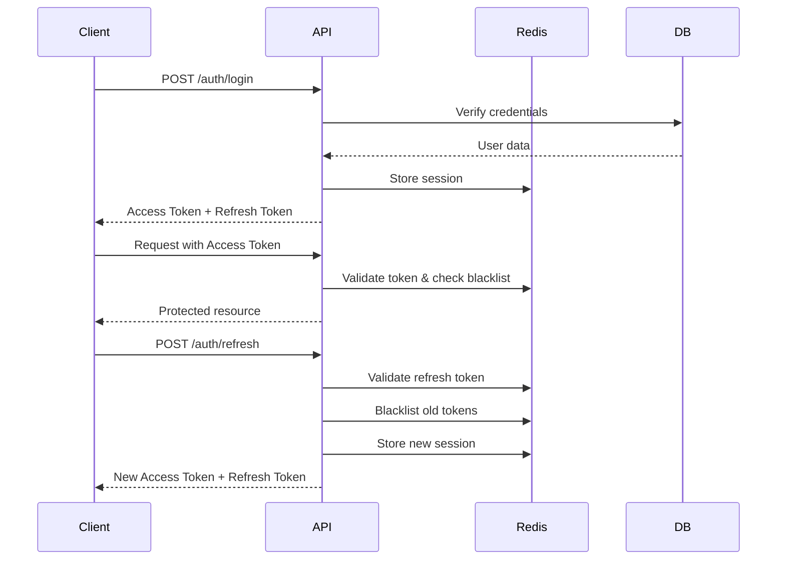
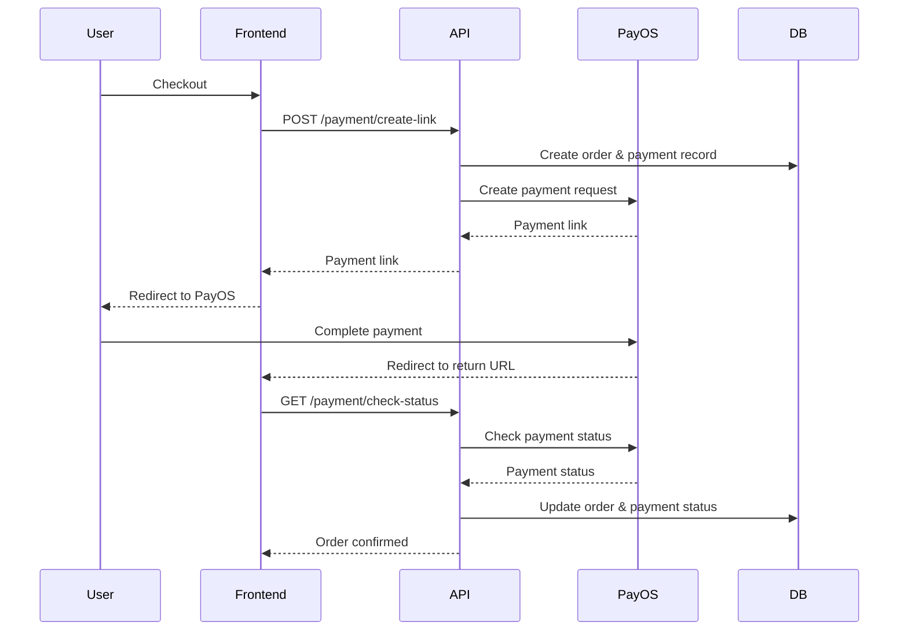

# 🚗 Laravel E-Commerce API - Car Dealership System

<p align="center">
  
</p>

<p align="center">
  <a href="https://laravel.com"></a>
  <a href="https://www.php.net"></a>
  <a href="https://github.com/VanTruongNg/laravel-ecommerce-api"></a>
</p>

## 📋 Table of Contents

-   [Introduction](#-introduction)
-   [Key Features](#-key-features)
-   [Tech Stack](#-tech-stack)
-   [Project Structure](#-project-structure)
-   [Installation](#-installation)
-   [Environment Configuration](#-environment-configuration)
-   [Queue & Background Jobs](#-queue--background-jobs)
-   [API Endpoints](#-api-endpoints)
-   [Database Schema](#-database-schema)
-   [Authentication & Authorization](#-authentication--authorization)
-   [Payment Integration](#-payment-integration)
-   [Testing](#-testing)
-   [Deployment](#-deployment)
-   [Contributing](#-contributing)
-   [License](#-license)

## 🎯 Introduction

**Laravel E-Commerce API** is a complete RESTful API backend system for an online car dealership application. Built on Laravel 12, it integrates JWT authentication, Redis caching, PayOS payment gateway, and AWS S3 storage.

### Highlights

-   ✅ RESTful API architecture with standardized responses
-   ✅ JWT-based authentication with refresh token rotation
-   ✅ Role-based access control (Admin/User)
-   ✅ Shopping cart with real-time inventory management
-   ✅ Order processing with multi-step workflow
-   ✅ PayOS payment gateway integration
-   ✅ Email verification & password reset
-   ✅ OAuth2 Google login
-   ✅ File upload with AWS S3
-   ✅ Redis caching & session management
-   ✅ Background job processing with queue workers
-   ✅ Docker containerization

## 🚀 Key Features

### 1. Authentication & User Management

-   User registration with email verification
-   Login with JWT tokens (access + refresh)
-   OAuth2 Google authentication
-   Password reset via email
-   Token refresh & revocation
-   Role-based permissions (Admin/User)

### 2. Car Management

-   CRUD operations for cars (Admin only)
-   Car listing with pagination and filtering
-   Car details with brand information
-   Inventory management (stock, availability)
-   Car image upload to AWS S3
-   Fuel types: Gasoline, Diesel, Electric, Hybrid

### 3. Brand Management

-   Car brand management (Admin only)
-   Brand listing
-   Brand details with car list

### 4. Shopping Cart

-   Add/remove products to/from cart
-   Update quantity
-   View user's cart
-   Clear cart
-   Real-time inventory validation

### 5. Order Management

-   Create orders from cart or direct purchase
-   View order history
-   Order details with order items
-   Cancel orders
-   Order status tracking: Pending, Completed, Cancelled
-   Admin dashboard to manage all orders

### 6. Payment Processing

-   PayOS payment gateway integration
-   Create payment links for orders
-   Check payment status
-   Webhook handling for payment status
-   Payment status: Pending, Paid, Cancelled

## 🛠 Tech Stack

### Backend Framework

-   **Laravel 12** - Modern PHP framework
-   **PHP 8.2+** - Latest PHP version with performance improvements

### Authentication & Security

-   **Firebase JWT** - JSON Web Token implementation
-   **Laravel Socialite** - OAuth2 authentication
-   **Redis** - Session & token blacklist management

### Database & Storage

-   **MySQL** - Primary database
-   **Redis** - Caching & session storage
-   **AWS S3** - Cloud file storage

### Payment

-   **PayOS** - Vietnamese payment gateway integration

### Development Tools

-   **Docker** - Containerization (MySQL, Redis, phpMyAdmin, Redis Commander)
-   **Pest PHP** - Modern testing framework
-   **Laravel Pint** - Code style fixer

### Email & Queue

-   **Laravel Mail** - Email sending with blade templates
-   **SMTP** - Email delivery configuration
-   **Laravel Queue** - Background job processing with database driver
-   **Queue Workers** - Asynchronous email delivery

## 📁 Project Structure

```
laravel-ecommerce-api/
├── app/
│   ├── Http/
│   │   ├── Controllers/
│   │   │   ├── AuthController.php       # Authentication & user management
│   │   │   ├── BrandController.php      # Brand CRUD operations
│   │   │   ├── CarController.php        # Car management
│   │   │   ├── CartController.php       # Shopping cart operations
│   │   │   ├── OrderController.php      # Order processing
│   │   │   └── PaymentController.php    # Payment integration
│   │   └── Middleware/
│   │       ├── JwtMiddleware.php        # JWT token validation
│   │       └── CheckRole.php            # Role-based access control
│   ├── Mail/
│   │   ├── VerificationEmail.php        # Email verification mail
│   │   └── ResetPasswordEmail.php       # Password reset mail
│   ├── Models/
│   │   ├── User.php                     # User model with roles
│   │   ├── Car.php                      # Car model with enums
│   │   ├── Brand.php                    # Brand model
│   │   ├── Cart.php                     # Shopping cart
│   │   ├── CartCar.php                  # Cart items pivot
│   │   ├── Order.php                    # Order model
│   │   ├── OrderDetail.php              # Order items
│   │   ├── Payment.php                  # Payment records
│   │   └── Token.php                    # Verification & reset tokens
│   ├── UploadService/
│   │   └── UploaderService.php          # AWS S3 file upload
│   └── utils/
│       └── Response.php                 # Standardized API responses
├── config/
│   ├── database.php                     # Database connections
│   ├── filesystems.php                  # S3 configuration
│   ├── mail.php                         # Email configuration
│   └── cors.php                         # CORS settings
├── database/
│   ├── migrations/                      # Database schema migrations
│   └── seeders/                         # Database seeders
├── routes/
│   └── api.php                          # API route definitions
├── docker-compose.yml                   # Docker services setup
└── README.md                            # This file
```

## 💻 Installation

### System Requirements

-   PHP >= 8.2
-   Composer
-   MySQL >= 8.0
-   Redis
-   Node.js & NPM (for asset compilation)
-   Docker & Docker Compose (optional, recommended)

### Installation Steps

#### 1. Clone repository

```bash
git clone https://github.com/VanTruongNg/laravel-ecommerce-api.git
cd laravel-ecommerce-api
```

#### 2. Install dependencies

```bash
composer install
npm install
```

#### 3. Create .env file

```bash
cp .env.example .env
```

#### 4. Generate application key

```bash
php artisan key:generate
```

#### 5. Start Docker services

```bash
docker-compose up -d
```

Services will run on:

-   **MySQL**: `localhost:3306`
-   **phpMyAdmin**: `http://localhost:8080`
-   **Redis**: `localhost:6379`
-   **Redis Commander**: `http://localhost:8081`

#### 6. Run migrations

```bash
php artisan migrate
```

#### 7. (Optional) Run seeders

```bash
php artisan db:seed
```

#### 8. Start development server

```bash
php artisan serve
```

API will run on `http://localhost:8000`

#### 9. Start queue worker (for background jobs)

```bash
# In a separate terminal
php artisan queue:work

# Or use queue:listen for development
php artisan queue:listen
```

This will process background jobs like sending emails asynchronously.

## ⚙️ Environment Configuration

### Database Configuration

```env
DB_CONNECTION=mysql
DB_HOST=127.0.0.1
DB_PORT=3306
DB_DATABASE=e_commerce
DB_USERNAME=root
DB_PASSWORD=root
```

### Redis Configuration

```env
REDIS_CLIENT=predis
REDIS_HOST=127.0.0.1
REDIS_PASSWORD=null
REDIS_PORT=6379
```

### JWT Configuration

```env
JWT_SECRET=your-secret-key-here
JWT_ACCESS_TOKEN_EXPIRY=900          # 15 minutes
JWT_REFRESH_TOKEN_EXPIRY=604800      # 7 days
```

### AWS S3 Configuration

```env
AWS_ACCESS_KEY_ID=your-access-key
AWS_SECRET_ACCESS_KEY=your-secret-key
AWS_DEFAULT_REGION=ap-southeast-1
AWS_BUCKET=your-bucket-name
AWS_USE_PATH_STYLE_ENDPOINT=false
```

### Mail Configuration

```env
MAIL_MAILER=smtp
MAIL_HOST=smtp.gmail.com
MAIL_PORT=587
MAIL_USERNAME=your-email@gmail.com
MAIL_PASSWORD=your-app-password
MAIL_ENCRYPTION=tls
MAIL_FROM_ADDRESS=your-email@gmail.com
MAIL_FROM_NAME="${APP_NAME}"
```

### PayOS Configuration

```env
PAYOS_CLIENT_ID=your-client-id
PAYOS_API_KEY=your-api-key
PAYOS_CHECKSUM_KEY=your-checksum-key
FRONTEND_RETURN_URL=http://localhost:3000/payment/success
FRONTEND_CANCEL_URL=http://localhost:3000/payment/cancel
```

### Google OAuth Configuration

```env
GOOGLE_CLIENT_ID=your-google-client-id
GOOGLE_CLIENT_SECRET=your-google-client-secret
GOOGLE_REDIRECT_URI=http://localhost:8000/api/auth/google/callback
```

### Queue Configuration

```env
QUEUE_CONNECTION=database    # Use database driver for queues
DB_QUEUE_TABLE=jobs         # Table name for storing jobs
DB_QUEUE=default            # Default queue name
DB_QUEUE_RETRY_AFTER=90     # Retry after seconds
```

## � Queue & Background Jobs

### Overview

This application uses Laravel Queue system to handle background jobs asynchronously, improving performance and user experience. Email sending operations are processed in the background using queue workers.

### Queue Driver

-   **Driver**: Database
-   **Table**: `jobs`
-   **Configuration**: `config/queue.php`

### Queued Jobs

#### Email Jobs

All emails are sent asynchronously using queues:

-   **Email Verification** - Sent after user registration
-   **Password Reset** - Sent when user requests password reset
-   **Resend Verification** - Sent when user requests verification email resend

#### Implementation

```php
// Email classes use Queueable trait
use Illuminate\Bus\Queueable;
use Illuminate\Queue\SerializesModels;

class VerificationEmail extends Mailable
{
    use Queueable, SerializesModels;
    // ...
}

// Emails are queued using queue() method
Mail::to($user->email)->queue(new VerificationEmail($user, $token));
```

### Queue Commands

```bash
# Start queue worker (processes jobs continuously)
php artisan queue:work

# Start queue listener (auto-reloads on code changes)
php artisan queue:listen

# Process only one job
php artisan queue:work --once

# Process jobs for specific queue
php artisan queue:work --queue=emails

# See failed jobs
php artisan queue:failed

# Retry failed job
php artisan queue:retry {id}

# Retry all failed jobs
php artisan queue:retry all

# Clear all jobs from queue
php artisan queue:clear

# Monitor queue in real-time
php artisan queue:monitor
```

### Queue Table Migration

Create the jobs table for database driver:

```bash
php artisan queue:table
php artisan migrate
```

This creates:

-   `jobs` table - Stores pending jobs
-   `failed_jobs` table - Stores failed jobs for retry

### Development vs Production

**Development:**

```bash
# Run queue worker in terminal
php artisan queue:listen
```

**Production:**

Use Supervisor to keep queue workers running (see Deployment section).

### Monitoring

-   Check pending jobs count: Check `jobs` table
-   Check failed jobs: `php artisan queue:failed`
-   Queue dashboard: Consider using Laravel Horizon for Redis queues

## �📡 API Endpoints

### Authentication Endpoints

| Method | Endpoint                              | Description               | Auth Required |
| ------ | ------------------------------------- | ------------------------- | ------------- |
| POST   | `/api/auth/register`                  | Register new account      | ❌            |
| POST   | `/api/auth/login`                     | Login                     | ❌            |
| GET    | `/api/auth/google`                    | Google OAuth login        | ❌            |
| GET    | `/api/auth/google/callback`           | Google OAuth callback     | ❌            |
| POST   | `/api/auth/verify-email/{token}`      | Verify email              | ❌            |
| POST   | `/api/auth/resend-verification-email` | Resend verification email | ❌            |
| POST   | `/api/auth/send-reset-password-email` | Send password reset email | ❌            |
| POST   | `/api/auth/reset-password/{token}`    | Reset password            | ❌            |
| POST   | `/api/auth/refresh`                   | Refresh access token      | ❌            |
| GET    | `/api/auth/user`                      | Get current user info     | ✅            |
| POST   | `/api/auth/logout`                    | Logout                    | ✅            |

### Car Endpoints

| Method | Endpoint           | Description              | Auth Required | Role  |
| ------ | ------------------ | ------------------------ | ------------- | ----- |
| GET    | `/api/cars`        | Get car list (paginated) | ❌            | -     |
| GET    | `/api/cars/newest` | Get newest cars          | ❌            | -     |
| GET    | `/api/cars/{id}`   | Get car details          | ❌            | -     |
| POST   | `/api/cars`        | Create new car           | ✅            | Admin |
| POST   | `/api/cars/{id}`   | Update car               | ✅            | Admin |
| DELETE | `/api/cars/{id}`   | Delete car               | ✅            | Admin |

### Brand Endpoints

| Method | Endpoint           | Description       | Auth Required | Role  |
| ------ | ------------------ | ----------------- | ------------- | ----- |
| GET    | `/api/brands`      | Get brand list    | ❌            | -     |
| GET    | `/api/brands/{id}` | Get brand details | ❌            | -     |
| POST   | `/api/brands`      | Create new brand  | ✅            | Admin |
| POST   | `/api/brands/{id}` | Update brand      | ✅            | Admin |
| DELETE | `/api/brands/{id}` | Delete brand      | ✅            | Admin |

### Cart Endpoints

| Method | Endpoint           | Description           | Auth Required |
| ------ | ------------------ | --------------------- | ------------- |
| GET    | `/api/cart/me`     | Get user's cart       | ✅            |
| POST   | `/api/cart/add`    | Add item to cart      | ✅            |
| DELETE | `/api/cart/remove` | Remove item from cart | ✅            |
| DELETE | `/api/cart/clear`  | Clear entire cart     | ✅            |

### Order Endpoints

| Method | Endpoint                 | Description       | Auth Required | Role  |
| ------ | ------------------------ | ----------------- | ------------- | ----- |
| GET    | `/api/order`             | Get all orders    | ✅            | Admin |
| GET    | `/api/order/me`          | Get user's orders | ✅            | User  |
| GET    | `/api/order/{id}`        | Get order details | ✅            | User  |
| POST   | `/api/order/create`      | Create new order  | ✅            | User  |
| DELETE | `/api/order/cancel/{id}` | Cancel order      | ✅            | User  |

### Payment Endpoints

| Method | Endpoint                                | Description          | Auth Required |
| ------ | --------------------------------------- | -------------------- | ------------- |
| POST   | `/api/payment/create-link`              | Create payment link  | ✅            |
| GET    | `/api/payment/check-status/{orderCode}` | Check payment status | ✅            |

### Upload Endpoint

| Method | Endpoint           | Description       | Auth Required |
| ------ | ------------------ | ----------------- | ------------- |
| POST   | `/api/upload/file` | Upload file to S3 | ✅            |

## 🗄 Database Schema

### Users Table

```sql
- id: uuid (PK)
- full_name: string
- email: string (unique)
- password: string (hashed)
- role: enum('user', 'admin')
- is_email_verified: boolean
- provider: string (nullable)
- provider_id: string (nullable)
- timestamps
```

### Cars Table

```sql
- id: uuid (PK)
- model: string
- year: integer
- color: string
- price: decimal
- brand_id: uuid (FK)
- image_url: string
- stock: integer
- fuel_type: enum('gasoline', 'diesel', 'electric', 'hybrid')
- availability: enum('in_stock', 'pre_order', 'out_of_stock')
- description: text (nullable)
- timestamps
```

### Brands Table

```sql
- id: uuid (PK)
- name: string (unique)
- description: text (nullable)
- logo_url: string (nullable)
- timestamps
```

### Carts Table

```sql
- id: uuid (PK)
- user_id: uuid (FK, unique)
- timestamps
```

### Cart_Car Pivot Table

```sql
- id: uuid (PK)
- cart_id: uuid (FK)
- car_id: uuid (FK)
- quantity: integer
- timestamps
```

### Orders Table

```sql
- id: uuid (PK)
- user_id: uuid (FK)
- total_price: decimal
- status: enum('pending', 'completed', 'cancelled')
- order_time: timestamp
- payment_code: integer (nullable)
- timestamps
```

### Order_Details Table

```sql
- id: uuid (PK)
- order_id: uuid (FK)
- car_id: uuid (FK)
- quantity: integer
- price: decimal
- subtotal_price: decimal
- timestamps
```

### Payments Table

```sql
- id: uuid (PK)
- order_id: uuid (FK)
- amount: decimal
- status: enum('pending', 'paid', 'cancelled')
- payment_method: string (nullable)
- transaction_id: string (nullable)
- timestamps
```

### Tokens Table

```sql
- id: uuid (PK)
- user_id: uuid (FK)
- token: string (unique)
- type: enum('email_verification', 'password_reset')
- expires_at: timestamp
- timestamps
```

## 🔐 Authentication & Authorization

### JWT Token Flow



### Token Structure

**Access Token** (15 minutes expiry):

```json
{
    "sub": "user-uuid",
    "email": "user@example.com",
    "name": "User Name",
    "role": "user",
    "type": "access",
    "iat": 1234567890,
    "exp": 1234568790,
    "jti": "token-uuid"
}
```

**Refresh Token** (7 days expiry):

```json
{
    "sid": "session-uuid",
    "sub": "user-uuid",
    "type": "refresh",
    "role": "user",
    "iat": 1234567890,
    "exp": 1235172690
}
```

### Role-Based Access Control

-   **Admin**: Full access to all endpoints
-   **User**: Access to user-specific endpoints (cart, orders, profile)

Middleware: `JwtMiddleware` + `CheckRole`

## 💳 Payment Integration

### PayOS Payment Flow



### Payment Status

-   `PENDING` - Awaiting payment
-   `PAID` - Payment successful
-   `CANCELLED` - Payment cancelled

## 🧪 Testing

### Run tests

```bash
# Run all tests
php artisan test

# Run specific test
php artisan test --filter=AuthControllerTest

# Run with coverage
php artisan test --coverage
```

## 🚀 Deployment

### Production Checklist

-   [ ] Set `APP_ENV=production` in `.env`
-   [ ] Set `APP_DEBUG=false`
-   [ ] Generate strong `APP_KEY` and `JWT_SECRET`
-   [ ] Configure production database
-   [ ] Configure Redis for caching
-   [ ] Set up proper CORS settings
-   [ ] Configure AWS S3 for file storage
-   [ ] Set up SSL certificate
-   [ ] Configure email service (SMTP)
-   [ ] Set up PayOS production credentials
-   [ ] Run `php artisan optimize`
-   [ ] Run `php artisan config:cache`
-   [ ] Run `php artisan route:cache`
-   [ ] Run `php artisan view:cache`
-   [ ] Create jobs table: `php artisan queue:table && php artisan migrate`
-   [ ] Set up queue worker with supervisor
-   [ ] Configure backup strategy

### Queue Worker Setup (Supervisor)

For production, use Supervisor to keep queue workers running:

```ini
[program:laravel-worker]
process_name=%(program_name)s_%(process_num)02d
command=php /path/to/artisan queue:work database --sleep=3 --tries=3 --max-time=3600
autostart=true
autorestart=true
stopasgroup=true
killasgroup=true
user=www-data
numprocs=2
redirect_stderr=true
stdout_logfile=/path/to/worker.log
stopwaitsecs=3600
```

Install and configure:

```bash
# Install supervisor
sudo apt-get install supervisor

# Create config file
sudo nano /etc/supervisor/conf.d/laravel-worker.conf

# Update supervisor
sudo supervisorctl reread
sudo supervisorctl update
sudo supervisorctl start laravel-worker:*
```

### Performance Optimization

```bash
# Cache configuration
php artisan config:cache

# Cache routes
php artisan route:cache

# Cache views
php artisan view:cache

# Optimize autoloader
composer install --optimize-autoloader --no-dev
```

## 📚 Documentation

### API Response Format

**Success Response:**

```json
{
    "success": true,
    "message": "Operation successful",
    "data": {
        // Response data
    }
}
```

**Error Response:**

```json
{
    "success": false,
    "message": "Error message",
    "errors": {
        // Validation errors or error details
    }
}
```

### Standard HTTP Status Codes

-   `200` - OK
-   `201` - Created
-   `400` - Bad Request
-   `401` - Unauthorized
-   `403` - Forbidden
-   `404` - Not Found
-   `422` - Validation Error
-   `500` - Internal Server Error

## 🤝 Contributing

Contributions are welcome! Please follow these steps:

1. Fork the repository
2. Create your feature branch (`git checkout -b feature/AmazingFeature`)
3. Commit your changes (`git commit -m 'Add some AmazingFeature'`)
4. Push to the branch (`git push origin feature/AmazingFeature`)
5. Open a Pull Request

### Coding Standards

-   Follow PSR-12 coding standard
-   Use Laravel best practices
-   Write meaningful commit messages
-   Add tests for new features
-   Update documentation

## 📝 License

This project is licensed under the MIT License - see the [LICENSE](LICENSE) file for details.

## 👥 Authors

-   **Van Truong Nguyen** - [@VanTruongNg](https://github.com/VanTruongNg)

## 🙏 Acknowledgments

-   [Laravel Framework](https://laravel.com)
-   [PayOS](https://payos.vn)
-   [Firebase JWT](https://github.com/firebase/php-jwt)
-   [AWS S3](https://aws.amazon.com/s3/)

## 📞 Support

If you encounter any issues or have questions, please:

-   Open an issue on GitHub
-   Contact via email: truongnguyen060603@gmail.com

---

<p align="center">Made with ❤️ by Van Truong Nguyen</p>
